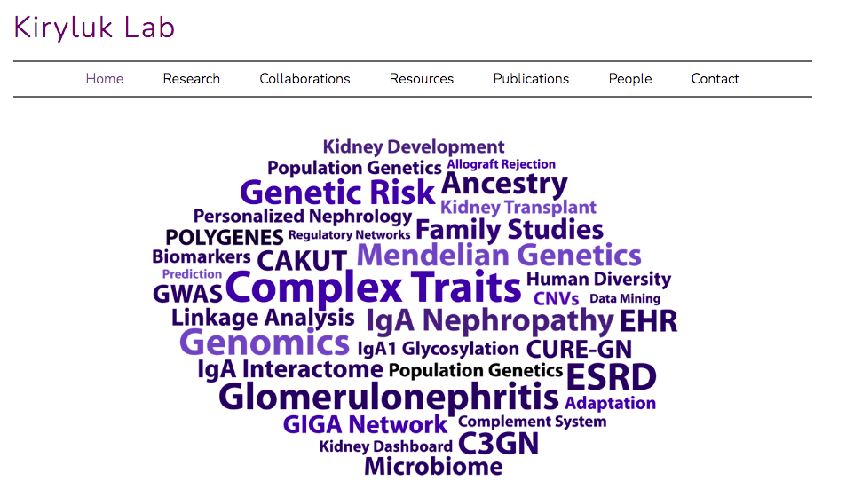

# Polygenic-risk-score-CALculation-PrsCAL-pipeline

Polygenic risk score CALculation (PrsCAL) is a polygenic score calculation pipeline based on LDpred (https://github.com/bvilhjal/ldpred). PrsCAL can be used only for the Step 3 of LDpred. For Step 1 and 2 please use LDpred and the details are here (https://github.com/bvilhjal/ldpred).

PrsCAL also using various R scripts to calculate all summary statistics for PRS.

# Useful links

LDpred (https://github.com/bvilhjal/ldpred)

# Install LDpred

pip install ldpred

pip install plinkio

or if you need to install it locally you can try

pip install --user plinkio

Please for details see:

https://github.com/bvilhjal/ldpred

# Usage of PrsCAL

First download the PrsCAL from our github page:

git clone https://github.com/AtlasCUMC/Polygenic-risk-score-CALculation-PrsCAL--pipeline

then 

cd Polygenic-risk-score-CALculation-PrsCAL--pipeline

python PrsCAL.v1.1.py --help 

********************************************************************* 

Atlas Khan

Kiryluk Lab (http://www.columbiamedicine.org/divisions/kiryluk/) 

Prs CALculation Tool (PrsCAL)

Version 1.0.0 

(C) 2021 Nephrology Dept of Medicine 

Columbia University Medical Center

*********************************************************************
usage: PrsCAL.v1.1.py [-h] [-bf The plink bed/bim/fam format data]

                      [-Method ldpred/p+t/stat] [-out Output file name]
                      
                      [-rf PRS equation file]
                      
                      [-PRS PRS file names from First Step PrsCAL]
                      
                      [-PCA The frq file for each of the CHR]
                      
                      [-Pheno Phenotype file with two columns]

The PrsCAL is a computational tool for calculation of polygenic score:

optional arguments:

  -h, --help            show this help message and exit
  
  -bf The plink bed/bim/fam format data, --bf The plink bed/bim/fam format data
                        The genotype data for PRS calucation in plink
                        bed/bim/fam format
                        
  -Method ldpred/p+t/stat, --Method ldpred/p+t/stat
                        For PRS calcualtion and summary statistics: Should be
                        give ldpred or p+t or stat
                        
  -out Output file name, --out Output file name
                        The name of output file
                        
  -rf PRS equation file, --rf PRS equation file
                        PRS equation file from ldpred Step 1 and Step2, please
                        see LDpred webiste for details
                        
  -PRS PRS file names from First Step PrsCAL, --PRS PRS file names from First Step PrsCAL
                        PRS file name with two columns: Column 1=IID and
                        Columna PRS
                        
-PCA PCA file, --PCA PCA file
                        PCA file should contain IID, PC1, PC2, PC3, PC4, or
                        more, Sex, Age and T2DM. Currently PrsCAL only adjust
                        for these covariates
                        
  -Pheno Phenotype file with two columns, --Pheno Phenotype file with two columns
                        Phenotype file with two columns: IID and pheno, for
                        CASE=1 and Control=0

                        

# Currently PrsCAL has two functions:

1. PrsCAL can be used to calculate PRS for a equation you get from first Two Steps of LDpred

2. PrsCAL can be also used for PRS summary statistics calculations: Such as odds ratios per statdation divisions, p-values, area under curve (AUC), percentile, such as Top 20% vs 80%,...,

# Covariates and Phenotype files

### Covariates file
Adjust for four PCs (PC1-C4), Age, Sex, Diabetes and Site/Batches if any

Covariates file should in tab delimited form:

IID PC1 PC2 PC3 PC4 Age Sex Site (Optional) T2DM1

### Sex coding

Male=0

Female=1

### T2DM1
Type2=1
else=0

### Site

Site1=1

Site2=2, etc

# Phenotpe file
Case=1 (CKD3 or greater)

Control=0

Phenotype file should in tab delimited form:

IID pheno

### Step 1. PrsCAL calculation 

This Step can be do only one time:

python PrsCAL.v1.1.py  -Method p+t -bf PLINK_format (Your plink format genotype data) -rf TEST (p+t or ldpred prefix) -out TEST

### Step 2. PrsCAL calculation

When run Step 1 or already you run the Step 1, PrsCAL can be used to caclulcate all summary statistics for PRS

### 1. Not adjusted for Site

python PrsCAL.v1.1.py  -Method stat -PRS TEST (Get from PrsCAL step 1) (IID, PRS; seprated by commas) -Pheno Phenotype_file -PCA Covariates_file -out TEST

### 1. Adjusted for Site or batches

python PrsCAL.v1.2.py -Method stat -PRS TEST (Get from the PrsCAL step 1) (IID, PRS; seprated by commas) -Pheno Phenotype_file -PCA Covariates_file -out TEST

# Adjust for APOL1 risk variants

The G1 and G2 variants are unique to African American. The allele frequencies for G1 and G2 alleles in African, Hispanic and Europeans are 10-15%, 0.5-2% and < 0.01% respectivelly. Therefore we will need to adjust the CKD PRS for APOL1 genotype risk variants. We modified as follows: 

### Caculate the summary statistics for CKD PRS

Here we will calcualte ORs, variance explain and top percentiles using PrsCAL step 2: 

### 1. Not adjusted for Site

python PrsCAL.v1.1.py  -Method stat -PRS TEST (Get from PrsCAL step 1) (IID, PRS; seprated by commas) -Pheno Phenotype_file -PCA Covariates_file -out TEST

### 1. Adjusted for Site or batches

python PrsCAL.v1.1.py -Method stat -PRS TEST (Get from the PrsCAL step 1) (IID, PRS; seprated by commas) -Pheno Phenotype_file -PCA Covariates_file -out TEST

# Author

Atlas Khan, 

Kiryluk Lab (http://www.columbiamedicine.org/divisions/kiryluk/), Department of Medicine (Division Nephrology), Columbia University Medical Centre, New York, USA.

Email: ak4046@cumc.columbia.edu and atlas.akhan@gmail.com

